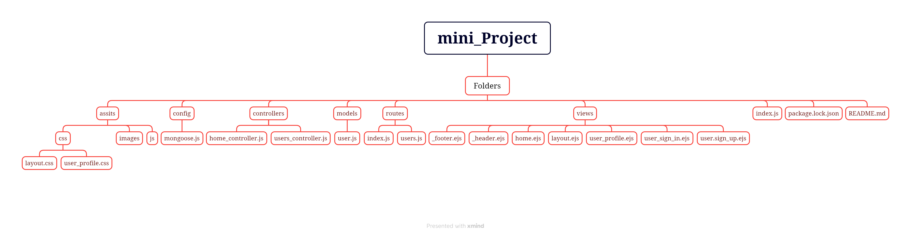

# Create the Directory structure and Setup express Server

# In this mini Project Setup dairectory of the pages and controllers

<ul>
In this Project we have created some folder (folder Structure)
<li>config</li>
<li>controllers</li>
<li>models</li>
<li>routes</li>
<li>views</li>
<li>assets</li>
</ul>

# File Struture 

# express ejs layouts

<ul>
<li>install the ejs layouts (npm install express-ejs-layouts)</li>
<li>import the main file like (index.js) as a call (const expresssLayouts = require('express-ejs-layouts'))</li>
<li>use express layouts</li>
<li>app.use(expressLayouts);</li>
<li>for style sheet <h5>app.use('layout extractStyles', true);</h5></li>
<li>for script <h5>app.use('layout extractScripts', true);</h5></li>
</ul>

# Create signIn and SignUp page and Setup the user controller 
<ul><li>module.exports.create = function(req, res){
}</li></ul>

# Setup the Cookies

<ul>
<li>install (npm install cookie-parser)</li>
<li>import the cookie-parser in the index.js file (const cookieParser = require('cookie-parser'))</li>
<li>Call the cookie parser (app.use(cookieParser()); )</li>
</ul>
<h5>Finaly we can se the cookies as a respose or request brower's application field.</h5>
<<<<<<< HEAD

# We use Passport Authentication 

We create an local Strategy Passport

npm install passport

# express session

npm install express-session

# Stabilish the server with the database

npm i connect-mongo@3

=======
>>>>>>> 34d327dc557b4f7ae0e149cc4a69956c23e8746d
